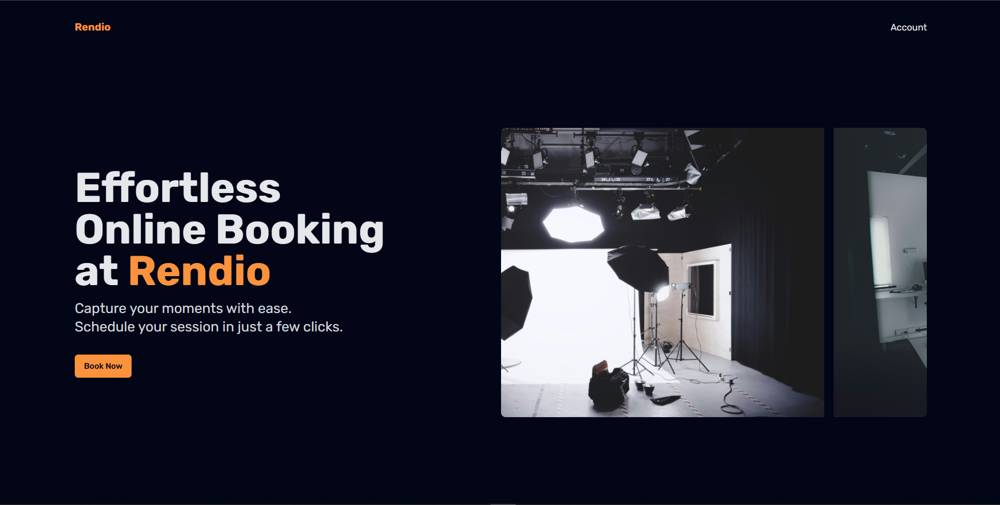

# Rendio

A web application to help clients book Rendio's photography / videography studio online.

Created for learning purposes.

## Techs

React + Vite, Typescript, TailwindCSS, Shadcn.

Axios and Mock Adapter were used to simulate fetching from an API endpoint.

## Installation & Setup

Installing the dependencies

```shell
npm install
```

Running the app on local machine

```shell
npm run dev
```

Visit the web page locally at localhost:5173

## Screenshots




